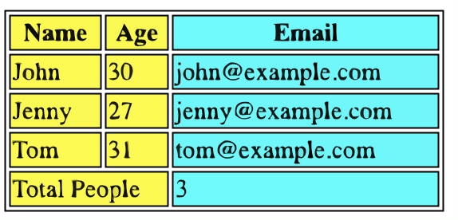

# Creating tables using the `<table>` tag in HTML

Tables! You've seen them everywhere—from Excel spreadsheets to data-heavy websites. HTML tables are a powerful tool for organizing and presenting data on a web page. They allow you to create a structured set of rows and columns, similar to a spreadsheet.
Using tables is one of the simplest methods to present data making it easier for users to understand and compare different types of information.

In this article, lets understand how the HTML semantic `<table>` tag works.

## What is `<table>` tag

The `<table>` tag in HTML serves as the foundation of your table. This tag becomes the main container of the table, indicating where the table structure begins and ends. Here's a skeleton example:

```html
<table>
  <!-- Table elements go here -->
</table>
```

## Fundamentals of HTML `<table>`

**Rows** of a table are created using the `<tr>` tag. Every `<tr>` can contain multiple cells (`<td>` or `<th>`), one for each column.

```html
<tr>
  <td>Data 1</td>
  <td>Data 2</td>
</tr>
```

**Columns** of the table are defined either as a header or a data cell.

### `<th>` Table Header

This defines the table header. By default, any text in the `<th>` tag is bold and centered. This tag is used to create column or row headings.

```html
<th>Column Title</th>
```

### `<td>` Table Data

This is where your actual content goes. It is also known as **table cells**. By default, any text in the `<td>` tag is left-aligned and has a normal font-weight.

```html
<td>Your data here</td>
```

## Sections of a Table

HTML tables can be divided into three main sections:

### 1. `<thead>`

This section is used to group the header content in a table. It usually contains column names or labels. Anything you put here appears at the top of the table.

```html
<table>
  <thead>
    <tr>
      <th>Name</th>
      <th>Age</th>
      <th>Email</th>
    </tr>
  </thead>
  <!-- More sections -->
</table>
```

In the above example, we are creating a table with 3 columns and having the headings of "Name", "Age" and "Email" respectively. We make use of `<tr>` to create rows of the table and `<th>` to add column headers to the table.

### 2. `<tbody>`

This section is used to group the body content in a table. It contains the bulk of your data. The body section is usually displayed after the header section.

```html
<table>
  <!-- ... -->
  <tbody>
    <tr>
      <td>John</td>
      <td>30</td>
      <td>john@example.com</td>
    </tr>
  </tbody>
</table>
```

In this example, we have added a single row of data to the table. Note that we make use of `<td>` to represent column data corresponding to the column header.

### 3. `<tfoot>`

This section is used to group the footer content in a table. The table footer often contains summary rows or notes, which are rarely utilized yet crucial for semantic reasons. By default, the footer section will be displayed at the bottom of the table.

```html
<table>
  <!-- ... -->
  <tfoot>
    <tr>
      <td>Stats:</td>
      <td>Total People</td>
      <td>1</td>
    </tr>
  </tfoot>
</table>
```

## Spanning Columns or Rows

In HTML, tables can have cells that span over multiple rows and/or columns. This is achieved using the `colspan`, `rowspan` attributes.

```html
<td colspan="2">I span two columns!</td>
<td rowspan="2">I span two rows!</td>
```

## `<colgroup>` and `<col>`

The `<colgroup>` element is used to style specific columns of a table and is often used in conjunction with the `<col>` element. You can use these tags to apply styles to entire columns without affecting the rows.

```html
<table>
  <colgroup>
    <col style="background-color: yellow;" span="2" />
    <col style="background-color: cyan;" />
  </colgroup>
  <!-- ... -->
</table>
```

Just like `colspan`, `span` takes a value that specifies the number of columns you want the styling to apply to.

## Fully working example

### Code

```html
<table>
  <colgroup>
    <col style="background-color: yellow;" span="2" />
    <col style="background-color: cyan;" />
  </colgroup>
  <thead>
    <tr>
      <th>Name</th>
      <th>Age</th>
      <th>Email</th>
    </tr>
  </thead>
  <tbody>
    <tr>
      <td>John</td>
      <td>30</td>
      <td>john@example.com</td>
    </tr>
    <tr>
      <td>Jenny</td>
      <td>27</td>
      <td>jenny@example.com</td>
    </tr>
    <tr>
      <td>Tom</td>
      <td>31</td>
      <td>tom@example.com</td>
    </tr>
  </tbody>
  <tfoot>
    <tr>
      <td colspan="2">Total People</td>
      <td>3</td>
    </tr>
  </tfoot>
</table>
```

### Output
<!--  -->


You've got it now! Creating HTML tables is now a snap for you. Happy coding!
